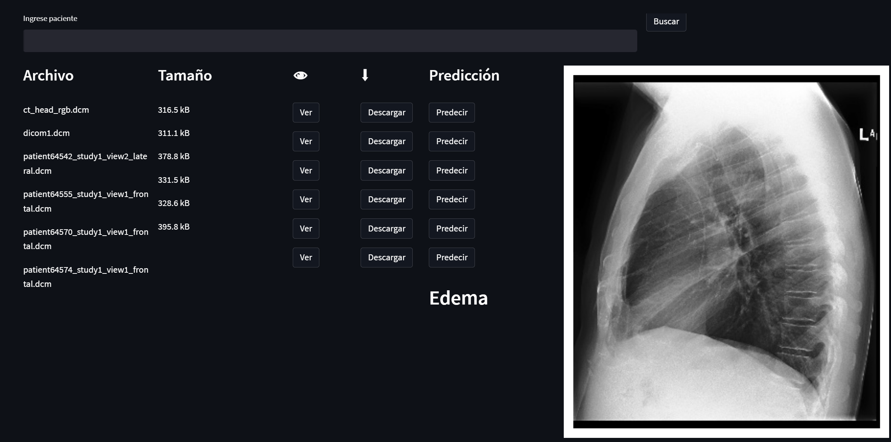

# INTERMEDICAL PACS

Curso: Aplicaciones clinicas en señales e imágenes
## Integrantes

Emilio Ochoa\
Luis Revilla\
Luis Leon\
Jose Montoya\
Adriana Romero\
Javier Condor

## Descripcion
El sistema implementa un visor de imagenes medicas utilizando streamlit y a su vez un clasificador de imagenes.

## Contributing
La contribucion es privada en este caso, si deseas puedes clonar el repositorio.

## License
[MIT](https://choosealicense.com/licenses/mit/)